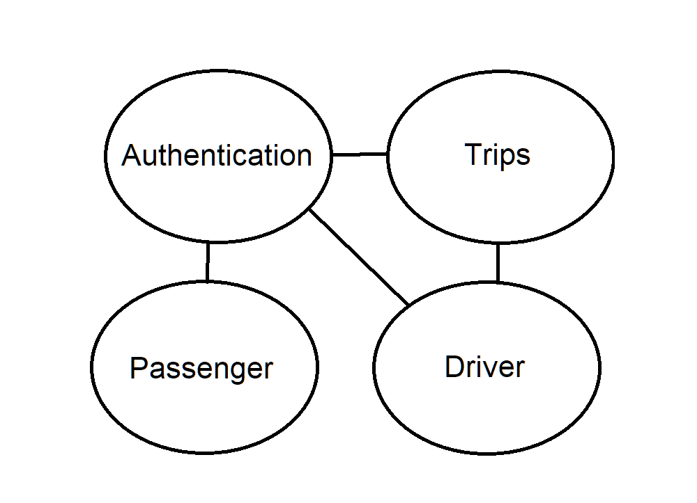

# ETI-Ooper

Ooper is a ride sharing platform created for an assignment. It utilizes a microservice architecture coded in Go for the backend of the application, and uses VueJS as the frontend framework.

# Microservices & Operations

| Microservice   | Endpoint           | Methods           | Description                                                                                                                            |
| -------------- | ------------------ | ----------------- | -------------------------------------------------------------------------------------------------------------------------------------- |
| Authentication | /api/v1/login      | POST              | Authenticates user using hashing and salting, and returns a JWT                                                                        |
| Authorization  | /api/v1/authorize  | POST, GET, DELETE | Decodes JWT and returns isPassenger and ID. POST takes JWT from body, while GET takes JWT from cookies. DELETE removes the jwt cookie. |
| Driver         | /api/v1/drivers    | PATCH, POST, GET  | Creates a new driver object, Gets a driver, or updates a driver                                                                        |
| Passenger      | /api/v1/passengers | PATCH, POST, GET  | Creates a new passenger object, Gets a passenger, or updates a passenger                                                               |
| Trip           | /api/v1/trips      | PATCH, POST, GET  | Obtains all trips for a passenger, or creates a new trip with an assigned driver                                                       |

_Most endpoints also accept the OPTIONS method for CORS requests_

# Design Considerations of Microservice

## General

The design of the microservices of the application had some key characteristics of a microservice in mind during development.

- Loosely Coupled
  - Designed to have as little calls to each other as possible
  - However, some do still make calls. These cases are minimized, and only done so when required
  - e.g. Authentication sends a GET request to passenger/driver to get details to verify their identity
- Organized around business capabilities
  - Each microservice represents one aspect of the solution
  - Drivers, Passenger, Trips each relate to a single table in a database

## Nouns & Verbs

To determine the domains of the potential microservices, the nouns & verbs approach was taken. They are identified as below

### Nouns

- Passenger
- Driver
- Trip

### Verbs

Users can **create** either accounts (Passenger/Driver)

Users can **update** any information in their account

A Passenger can **request** for a trip

Platform will **assign** an available driver

Driver will be able to **initiate** a start/end trip

Passenger can **retrieve** all the trips they have taken

_All information taken from introduction section of problem_

### Conclusions

From the nouns & verbs exercise, it can be seen that there are 3 microservices - for Passengers, Drivers, and Trips. The microservices will not usually communicate with each other, as it is not required. The sole exception for this would be assigning an available driver for a requested trip. In the implementation, the trips microservice obtains an available driver from the driver microservice, and then creates a new trip with the available driver assigned.

## Authentication

An authentication microservice is also added to facilitate logging in to the platform and authorizing users.

It does not have it's own database, but is it's own microservice because it is more resource-intensive than the usual CRUD operations that the other Microservices carry out. This is due to the process in which the authentication function authenticates users - adding a salt to the password and passing it through a hashing function. Then, the authentication function creates a JWT based on the particulars, and sends the JWT as a response.

Giving the login function the ability to scale independently from other functions would hence be helpful. The load on the passengers and drivers microservice would be light in comparison, as it would only be GETting the details of these users and passing it to the authentication microservice.

## Domain Diagram

The final domain diagram is as shown below:

# Architecture Diagram

The architecture diagram for the non-containerized version is shown below:

# Set-up instructions

## Local

1. Run DB Create script
   - Creates database called "ooper"
2. CD to "ooper" and run "npm install" to install all dependencies for frontend
3. CD to each individual \*Microservice file and run "go get" to install all dependencies for backend
4. Run each \*Microservice folder's main.go file using "go run ."
5. Run frontend by using "npm run serve"
6. Go to http://localhost:8080 to access the application

NOTE: The frontend uses google maps for a page. To enable it, in the ooper folder, insert VUE_APP_GMAPS_KEY=[INSERT_KEY_VALUE] into the .env file.

NOTE: The application assumes that there is a user "user" with password "password" for the database.
If this is not so, uncomment the last two lines of the DB create script **OR** change the database connection string in each main.go file (except the authentication microservice)

## Docker Compose

For the docker-compose file to work, it requires 'trip.sql', 'passenger.sql', and 'driver.sql'. View the bind mound location in the docker-compose file to put the files in the correct directory, or change where they point to by default. (If you're cloning the repo and running the docker-compose, there'll be no issue.)

1. Run docker-compose -f ".\docker-compose-multistage-image.yml" up -d
2. Go to http://localhost:8080 to access the application
